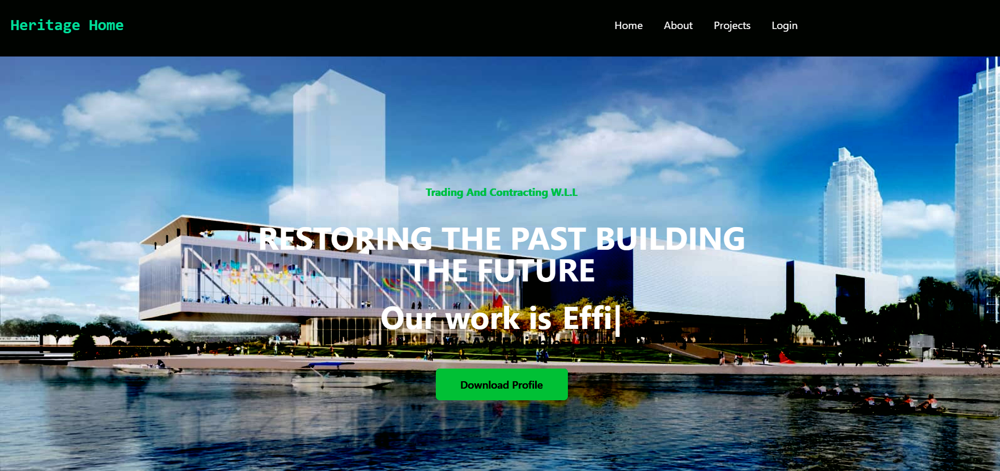

# 📦 Project Name

This is a construction company's website, where they can display their legal documents and contruction projects they're working in and completed,

## 🚀 Live Demo

[Click here to try the app](https://ephemeral-stroopwafel-8f5177.netlify.app/)

---

## 📸 Screenshots



## 👥 User Roles

- 🔐 Account creation needs authorization from Admin
- 🔏 Authorized users can upload or delete projects through the Form route

---

## 🔑 Demo Login Credentials

> 💡 Use **only dummy data** for demo accounts

- **Admin Login**  
  Email: `admin@gmail.com`  
  Password: `!@#123Qq`

---

## 🧩 Key Features

- 🔒 Authorized Account Creation
- 🕵️ Hidden admin-only route: `/!@$` not exposed in UI
- 💾 Integrated with Firestore / Firebase / Firebase Storage
- 📱 Fully responsive UI using Tailwind
- 🛠️ Built with React.JS

---

## 🛠️ Tech Stack

- Frontend: React / Tailwind /
- Backend: Serverless
- Database: MongoDB / Firebase / Firestore
- Auth: Firebase

---

## 🚧 How to Run Locally

```bash
# 1. Clone the repo
git clone https://github.com/your-username/your-repo-name.git

# 2. Go into the folder
cd your-repo-name

# 3. Install dependencies
npm install

# 4. Run the development server
npm run dev
```
